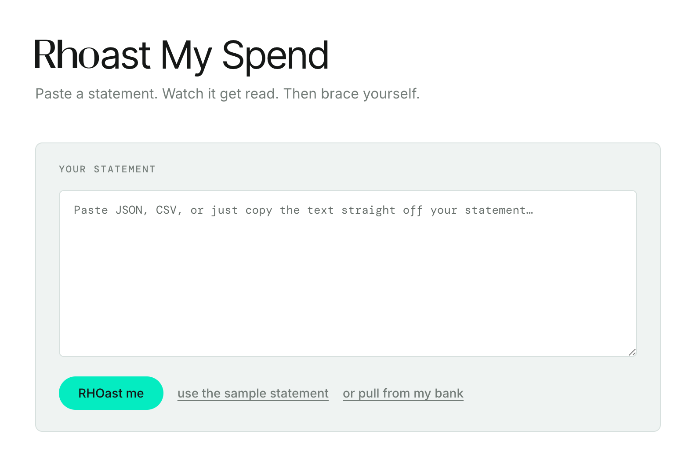
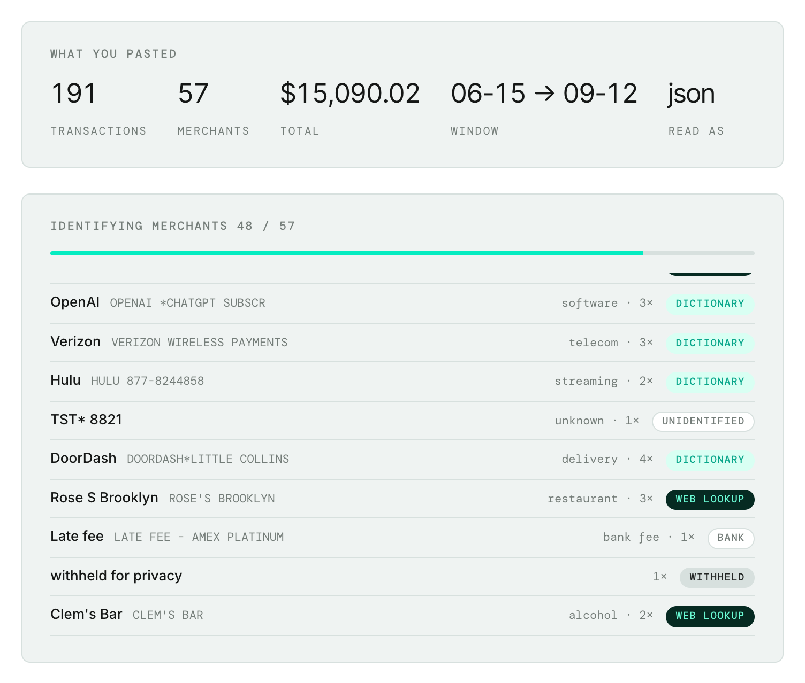
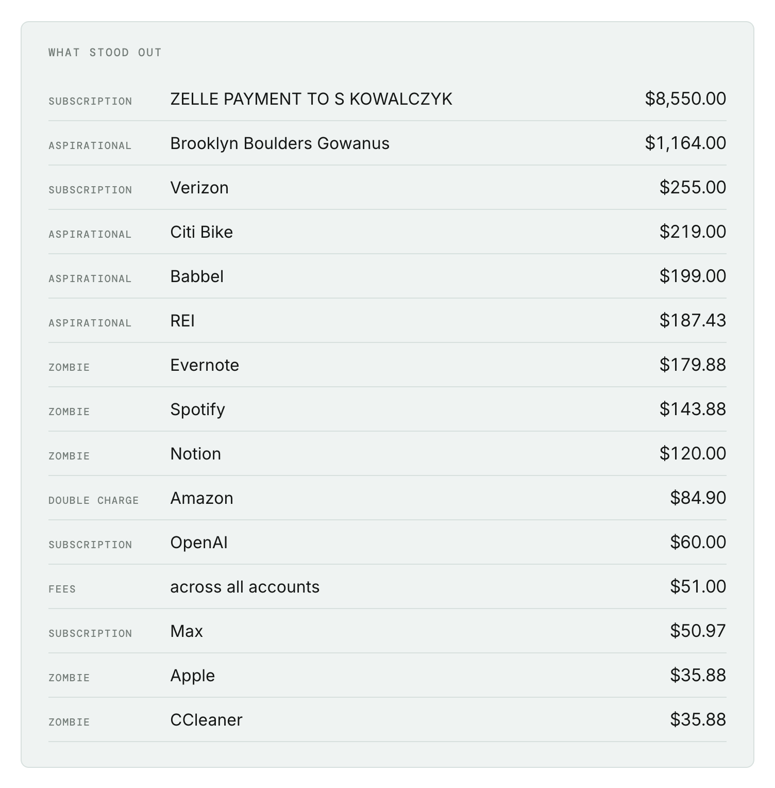
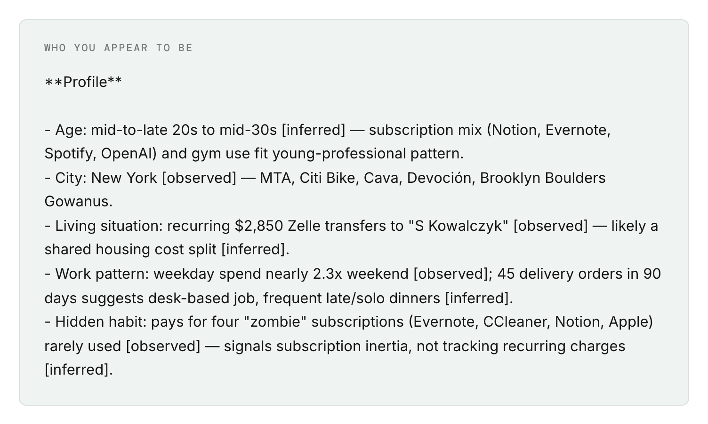
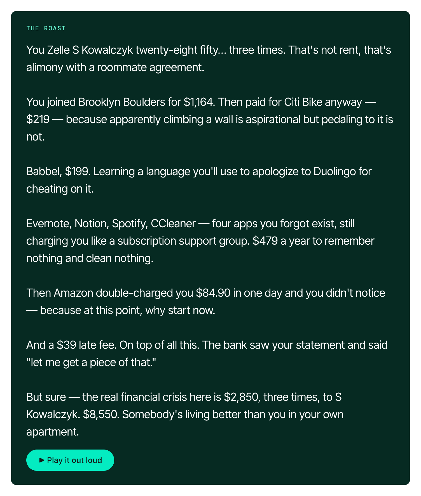

# RHOast My Spend

Not a budgeting app. A character assassination with citations.

Reads a bank statement, researches every merchant on the live web,
finds the patterns, and roasts you out loud.

## What it does

1. Ingests transactions (Plaid Sandbox, or a local JSON file)
2. Cleans raw bank descriptors — `SQ *MERCHANT 4471` → `Merchant`
3. Resolves each merchant to a real company via Tavily web search
4. Detects patterns in code: subscriptions,
   aspirational purchases, duplicate services, delivery-vs-groceries
5. Generates a roast with Claude, grounded in those specific findings
6. Speaks it with ElevenLabs

## Demo

📹 [Watch the 3-minute demo](https://youtube.com/watch?is=qGVBvbWs1nM6nvuM&v=1jZU8trfLCk&feature=youtu.be)


## Screenshots

**Paste a statement.** JSON, CSV, or raw text copied straight off your
statement. Or load the bundled sample, or pull from Plaid Sandbox.



**Watch merchants get identified.** Each descriptor streams in tagged with
how it was resolved — dictionary hit, live web lookup, bank-internal,
unidentified, or withheld (a sensitive category filtered before the model
ever sees it).



**See what stood out.** Deterministic pattern detection: subscriptions,
zombie subscriptions, aspirational buys, double charges, and fees.



**Read the profile.** Claude infers who you appear to be, with every claim
tagged `[observed]` or `[inferred]`.



**Get roasted.** Grounded in the findings above, then read aloud by
ElevenLabs.



## Safety

Nine transaction categories are filtered out **in code, before the
model sees them** — medical, pharmacy, legal, lenders, childcare,
recovery, religious, charity, adult.

This is a hard filter, not a prompt instruction. The roast targets
spending choices, never circumstances. The UI reports how many
transactions were excluded.

## Setup

Requires Python 3.10+.

```bash
git clone <repo-url>
cd roast-my-spend
python3 -m venv venv
source venv/bin/activate          # Windows: venv\Scripts\activate
pip install -r requirements.txt

cp .env.example .env
# fill in your own keys
```

### Getting keys (all free)

| Service | Where | Notes |
|---|---|---|
| Plaid | dashboard.plaid.com | Use the **Sandbox** secret |
| Tavily | app.tavily.com | 1,000 credits/month, no card |
| Anthropic | console.anthropic.com | |
| ElevenLabs | elevenlabs.io | Grab a voice_id from your voice library |

## Running it

```bash
uvicorn server:app --reload
```

Open http://localhost:8000

## Sample data

`sample.json` contains a synthetic 90-day statement with real merchant
names. It runs without Plaid credentials — useful for testing the
pipeline with only a Tavily and Anthropic key.

The transactions are handwritten; the insights are not. The pipeline
derives every finding.

## Using Plaid instead

Set your Plaid keys in `.env` and run:

```bash
python plaid_fetch.py
```

This creates a Sandbox connection and writes `plaid_sample.json`.
No real bank account involved.

## Tech stack

- **Plaid** — transaction data (Sandbox)
- **Tavily** — live merchant research
- **Claude** — pattern synthesis and roast generation
- **ElevenLabs** — voice delivery
- **FastAPI** + vanilla HTML

## Notes

- Merchant resolution results are cached to `cache.json` to conserve
  Tavily credits. Delete it to force fresh lookups.
- Originally built against the Rho transaction schema;


## License

MIT